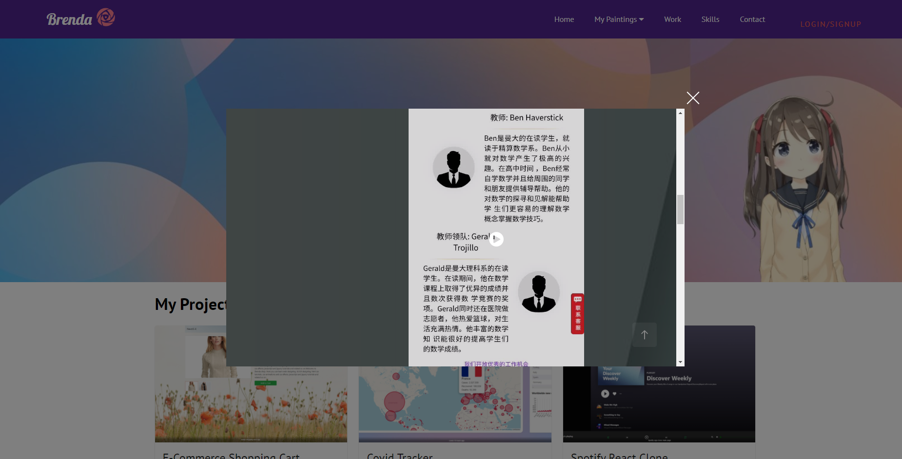
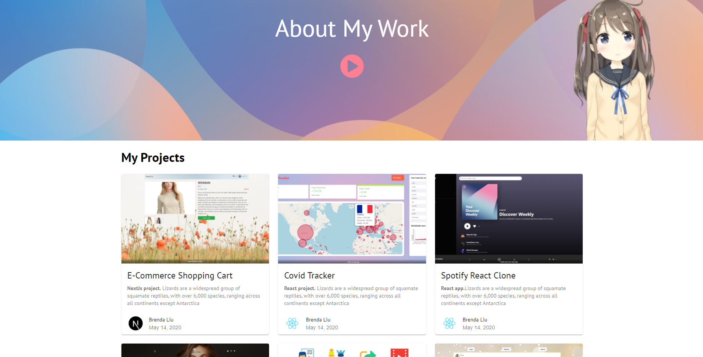
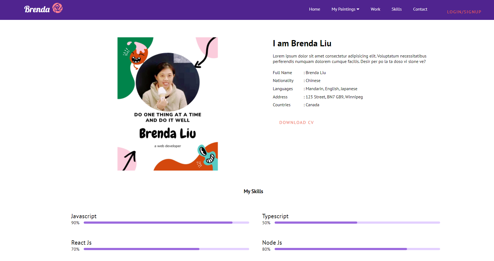
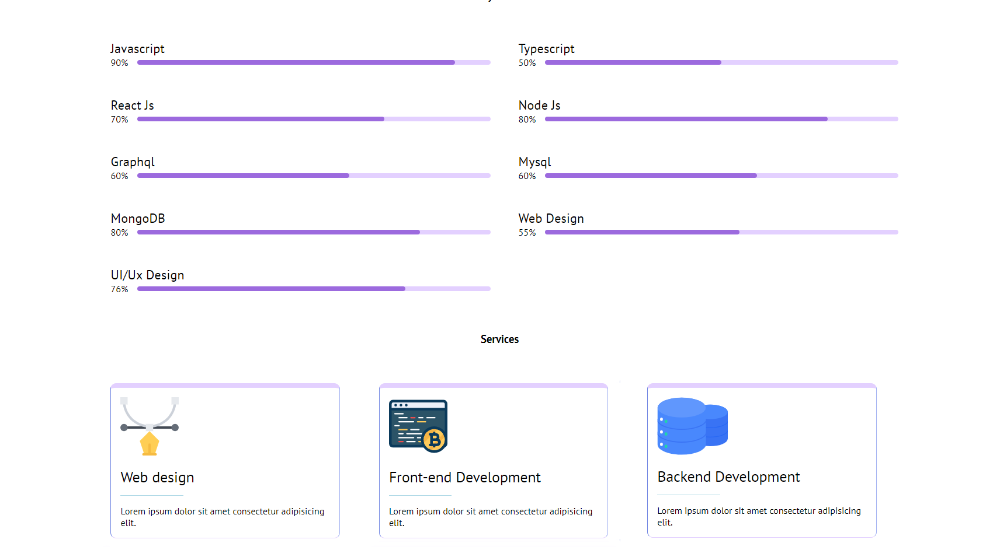
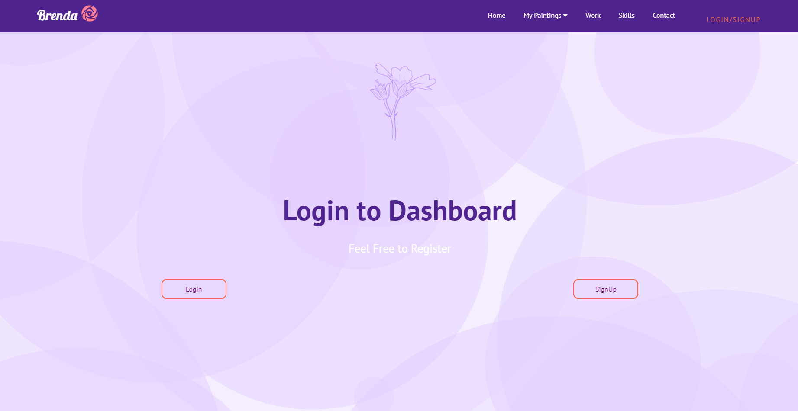
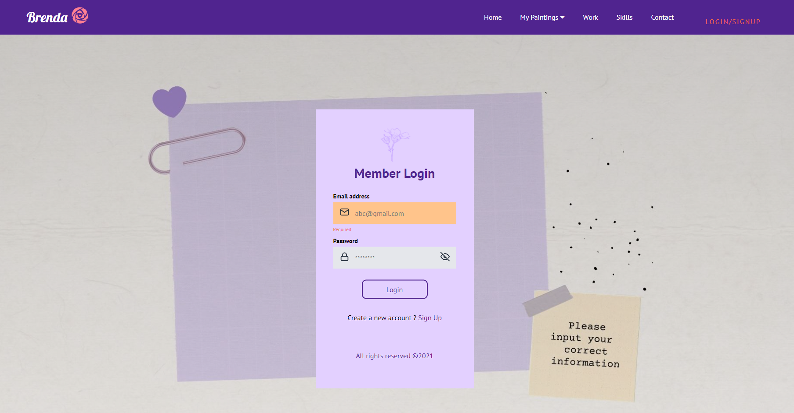
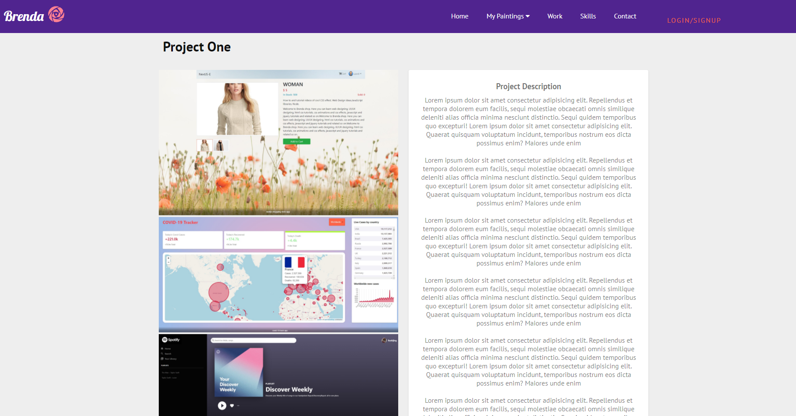
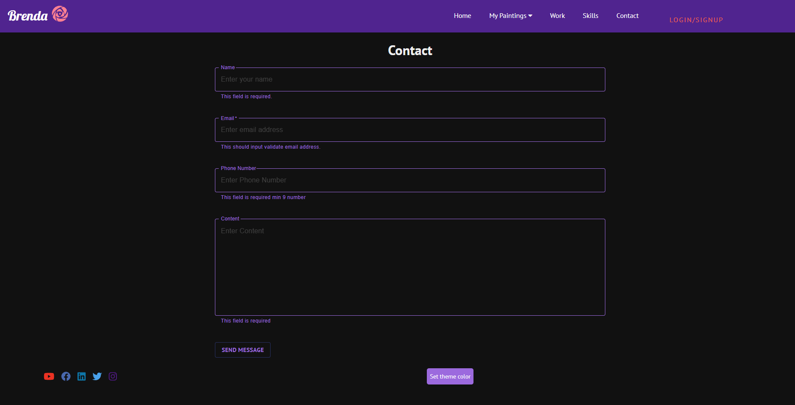

### FS 1010 course project image gallery web app

2021-1

install all dependencies before run

```
npm install
```

```
npm start
```

Enable backend repo https://github.com/shijing0628/FS1020-course-project-final at port 5000.

```
npm install
```

```
npm run dev
```

**Image gallery web app project introduction**

- navbar: class component + css file
- react router to link different pages
- home page: function component + styled-components: auto display feature
- my painting page:axios call from unsplash api(https://unsplash.com/documentation#search-photos), material-UI,hooks, pagination
- https://github.com/theanam/react-awesome-lightbox plugin for lightbox feature in gallery page(component> imageList.js file)
- contact form : after input validate info, button will show success submit(sendmessage - sending - success send). It goes to express project of FS1020 PORT 5000, we can receive data in data/entiresDB.json
- register page includes (sign up & login page)
- yup plugin for validation form
- formik plugin to build form (https://formik.org/docs/api/useField)
- react-loader-spinner plugin after click login, showing a loading status
- auth part (login & signUp) uses redux, store, reducer thunk and action. (localhost:5000/auth and localhost:5000/users are designed as route on backend)
- redux-react-session to save token getting from server side (savesession()), save to local cookies, once receive it, loadsession() to dashboard.js file.
- axios fetch data from server (response.data is what we need all info)
- If validation failed, we will get 400 error and in userAction.js file-> loginUser function will catch that error, and we can display the error message by using formik setFieldError. (each input tag has to include name="email" etc because the setFieldError distingush the error info from name property.)
- particles-bg package for background decoration of dashboard page and register page
- sass styles on skills page
- customized sliders in figma
- theme can toggle background color
- add social media icons









<br>



